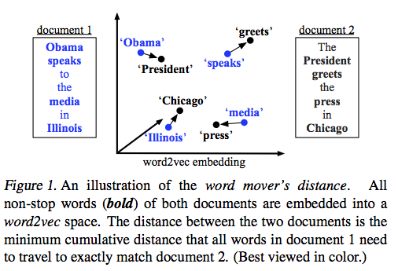

# Word Mover's Distance (WMD) from Matthew J Kusner

Source: [http://mkusner.github.io/](http://mkusner.github.io/)

Here is version 1.0 of Python and Matlab code for the Word Mover's Distance from the paper ["From Word Embeddings to Document Distances"](http://jmlr.org/proceedings/papers/v37/kusnerb15.pdf)

## Prerequisites

- Python 2.7 
- packages: 
- gensim 
- numpy 
- scipy 

If you download [Anaconda Python 2.7](http://continuum.io/downloads) it has everything. 

You'll also need to download word2vec embedding trained on the [Google News corpus](https://drive.google.com/file/d/0B7XkCwpI5KDYNlNUTTlSS21pQmM/edit?usp=sharing) (described briefly [here](https://code.google.com/p/word2vec/) in 'Pre-trained word and phrase vectors') 

## Building

You'll need to build:

- `python-emd-master/`: just go into the directory and type `make` 
- If you want to use matlab then you'll have to build `emd/` . Just open matlab, go to the directory, and type `build_emd`

## Getting started

Here's some example code with `all_twitter_by_line.txt`:

    python get_word_vectors.py all_twitter_by_line.txt twitter_vec.pk twitter_vec.mat 
    python wmd.py twitter_vec.pk twitter_wmd_d.pk 

Matlab: 

    >> wmd_mat (changing load_file to 'twitter_vec.mat' and save_file to whatever you like) 

## More detailed explanation    

`get_word_vectors.py`: This extracts the word vectors and BOW vectors. This is the script you will run first. You call it like this: 

    python get_word_vectors.py input_file.txt vectors.pk vectors.mat 

the last argument saves a `.mat` file (I think you technically have to now, but I will make this optional soon). The first argument is the text document you want to process, it assumes the input text file is in the following format: 

    doc1_label_ID \t word1 word2 word3 word4 
    doc2_label_ID \t word1 word2 word3 word4 
    ... 

Specifically, each document is on one line. The first thing on the line (`doc1_label_ID`) signifies the label of the document. For example if you have a set of tweets labeled by their sentiment (e.g. positive, negative, neutral), then this describes the label. Look at the file `all_twitter_by_line.txt` for an example. This is followed by a tab character: `\t`. Then each word of the document is separated by a space (it can be multiple spaces, it doesn't matter). The words can have punctuation and whatnot, this gets stripped by the python script. 

The second argument is the name of the pickle file that saves the word vectors, and the third is a mat file with the same results (used for matlab code later if you like). 

After you run this code then you'll run `wmd.py`. This computes the distance matrix between all documents in the saved file above. You call it like this: 

    python wmd.py vectors.pk dist_matrix.pk 

where `vectors.pk` was generated by the first script. 

Use `wmd_mat.m` if you'd like to use Matlab instead of `wmd.py`. You will need to change the variable `load_file` to `vectors.mat` and `save_file` to whatever name you like. 

## KNN

In the paper, we used cross-validation to set k for each dataset and tried these k's [1,3,5,7,9,11,13,15,17,19].  We also implemented a KNN function that given a k (or a list of k's) would only classify a point if the majority of the k nearest neighbors voted on the same class. If not, then we would reduce k (by 2) and consider if for this smaller k there was a majority vote for a class. This would continue this way until either a majority was reached or k=1 (in which case we just use the nearest neighbors vote). This function is in the file [knn_fall_back.m](https://github.com/mkusner/wmd/blob/master/knn_fall_back.m)

## Paper Datasets

Here is a Dropbox link to the datasets used in the paper: https://www.dropbox.com/sh/nf532hddgdt68ix/AABGLUiPRyXv6UL2YAcHmAFqa?dl=0

They're all matlab .mat files and have the following variables (note the similarity to the demo dataset):

**for bbcsport, twitter, recipe, classic, amazon**
- `X [1,n+ne]`: each cell corresponds to a document and is a `[d,u]` matrix where `d` is the dimensionality of the word embedding, `u` is the number of unique words in that document, `n` is the number of training points, and `ne` is the number of test points. Each column is the word2vec vector for a particular word.
- `Y [1,n+ne]`: the label of each document
- `BOW_X [1,n+ne]`: each cell in the cell array is a vector corresponding to a document. The size of the vector is the number of unique words in the document, and each entry is how often each unique word occurs.
- `words [1,n+ne]`: each cell corresponds to a document and is itself a `{1,u}` cell where each entry is the actual word corresponding to each unique word
- `TR [5,n]`: each row corresponds to a random split of the training set, each entry is the index with respect to the full dataset. So for example, to get the BOW of the training set for the third split do: `BOW_xtr = BOW_X(TR(3,:))`
- `TE [5,ne]`: same as TR except for the test set

for **ohsumed, reuters (r8), 20news (20ng2_500)**

The only difference with the above datasets is that because there are pre-defined train-test splits, there are already variables `BOW_xtr`, `BOW_xte`, `xtr`, `xte`, `ytr`, `yte`.

## Feedback & Contact

Let me know if you have any questions at mkusner AT wustl DOT edu. Please cite using the following BibTeX entry (instead of Google Scholar): 

    @inproceedings{kusner2015doc, 
       title={From Word Embeddings To Document Distances}, 
       author={Kusner, M. J. and Sun, Y. and Kolkin, N. I. and Weinberger, K. Q.}, 
       booktitle={ICML}, 
       year={2015}, 
    } 
